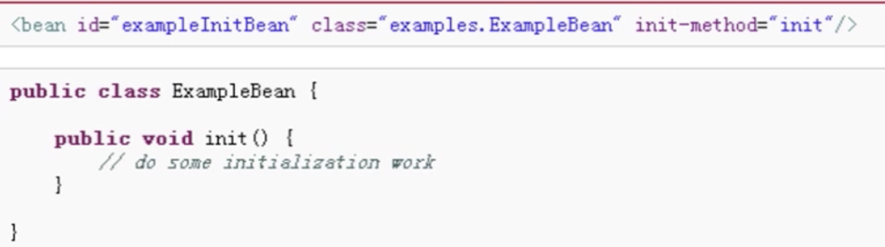
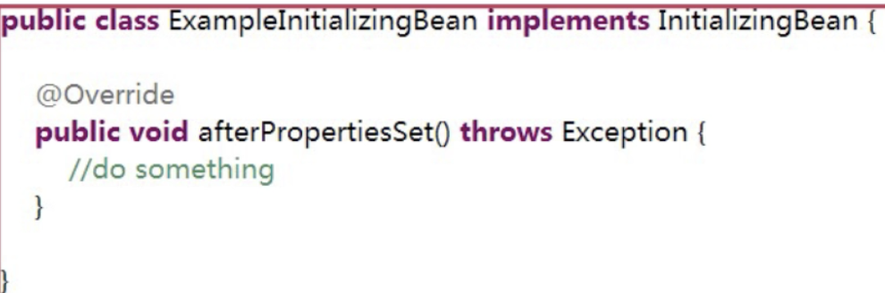
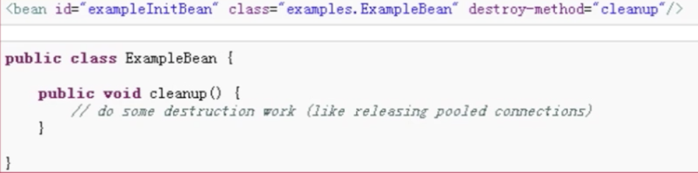
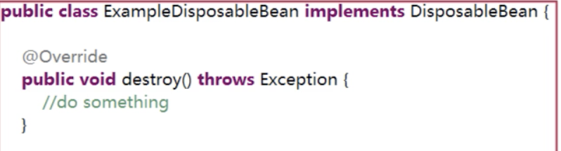
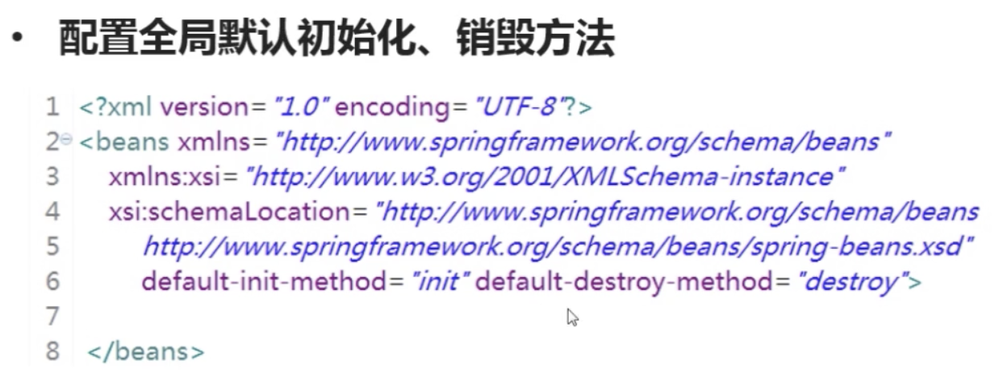

### 简介
Spring 是为解决企业应用程序开发发杂性而创建的一个java开源框架，<br>
业内流行的SSH架构中的其中一个"S"指的就是Spring.
#### 框架
框架就是指定一套规范或者规则，大家在该规范或者规则下工作。或者说是使用别人大号的舞台，你来表演
#### 特点
半成品，分装了特定的处理流程和控制逻辑，成熟的、不断升级改进的软件
#### 框架与类库的区别
框架一般是封装了逻辑、高内聚的，类库则是松散的工具组合，框架专注于某一领域，类库是更通用的。
### 专题一IOC
#### 什么是IOC
IOC：控制反转，控制权的转移，应用程序本身不负责依赖对象的创建和维护，<br>
而是由外部容器负责创建和维护<br>
DI(依赖注入)是其中一种实现方式<br>
目的：创建对象并且组装对象之间的关系<br>
英语：inversion of Control 中文：控制反转<br>
基本概念是：不创建对象，但是描述创建他们的方式。在代码中不直接与对象和服务连接，<br>
但在配置文件中描述哪一个组建需要哪一项服务。容器负责将这些联系在一起<br>
简单的来将，就是由容器控制程序之间的关系，而非传统实现中，由程序代码直接操控。<br>
这也就是所谓“控制反转”的概念所在：控制权由应用代码中转到外部容器，<br>
控制权的转移，是所谓反转<br>
```java
package com.imooc.ioc.interfaces;

public interface OneInterface{

  String hello(String word);

}
public class OneInterfaceImpl implements OneInterface{

  public String hello(String word){
    return "Word from interface\"OneInnterface\":"+word;
  }
}

public class Main{
  public static void main(String[] args){
    OneInterface oif=new OneInterfaceImpl();
    System.out.println(oif.hello("word."));
  }

}
```
#### Spring 的Bean配置

刚才的接口在Spring中的配置方式<br>
``` xml
<?xml version="1.0"enconding="UTF-8"?>
<beans xmlns="http://www.springframework.org/schema/beans"
  xmlns:xsi="http://www.w3.org/2001/XMLSchema-instance"
  xsi:schemaLocation="http://www.springframework.org/schema/beans
    http://www.springframework.org/chema/beans/spring-beans.xsd">

    <bean id="oneInterface" class="com.imooc.ioc.interfaces.OneInterfaceImpl"></bean>
  </beans>
```
``` java
package com.imooc.test.ioc.interfaces;

import org.junit.Test;
@RunWith(BlockJUnit4ClassRunner.class)
public class TestOneInterface extends UnitTestBase{

  public TestOneInterface(){
    super("classpath*:spring-ioc.xml");
  }
  @Test
  public void testHello(){
    OneInterface oneInterface=super.getBean("oneInterface");
    System.out.println(oneInterface.hello("我的输入参数"));
  }
}
```
#### Spring 注入
Spring注入是指在启动Spring 容器加载bean配置的时候，完成对变量的赋值行为<br>
常用的两种注入方式<br>
- 设值注入<br>
- 构造注入<br>

### 专题二 bean
Bean配置项<br>
Bean的作用域<br>
Bean的生命周期<br>
Bean的自动装配<br>
Resources&ResourceLoader<br>
#### 配置项
Id  在整个IOC容器内唯一标识<br>
Class 具体要实例化的哪一个类<br>
Scope 指它的范围，也就是作用域<br>
Constructor arguments   构造参数 <br>
Properties   属性<br>
Autowiring mode  自动装配的模式<br>
lazy-iniitialization mode 懒加载模式<br>
Initialization/destruction method 初始化和销毁的方法<br>
以上这些配置项共同组成了Spring IOC容器对于Bean的配置<br>
#### Bean的作用域
singleton:单列，指一个Bean容器中只存在一份<br>
prototype:每次请求（每次使用）创建新的实例，destroy方式不生效<br>
request：每次http请求创建一个实例且仅在当前request内有效<br>
session:同上，每次http请求创建，当前session内有效<br>
global session ：基于portlet的web中有效（portlet定义了global session),如果在web中，同session。<br>
#### Bean的生命周期
##### 初始化
- 实现org.springframework.beans.factory.InitializingBean接口，<br>
覆盖afterPropertiesSet方法<br>
- 配置init-method<br>


##### 销毁
- 实现org.springframework.beans.factory.DisposableBean接口<br>
,覆盖destroy方法<br>
- 配置destroy-method<br>



####  Aware
Spring 中提供了一些以Aware结尾的接口，实现了Aware接口的bean在被初始化之后，<br>
可以获取相应资源<br>
通过Aware接口，可以对Spring相应资源进行操作（一定要慎重）<br>
为对Spring进行简单的扩展提供了方便的入口<br>
