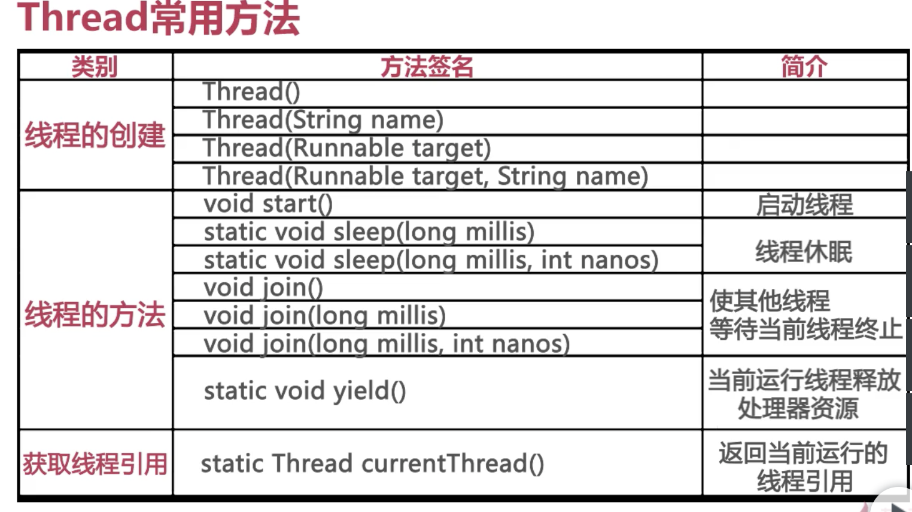

#### 进程
程序的执行过程<br>
持有资源（共享内存， 共享文件）和线程<br>
#### 线程
线程是系统中最小的执行单元<br>
同一进程中有多个线程<br>
线程共享进程的资源<br>
#### java中线程的常用方法介绍

```JAVA
package com.imooc.concurrent;

public class Actor extends Thread{

  public void run(){
    System.out.println(getName()+"是一个演员！");
    int count=0;
    boolean keepRunning=true;
    while(keepRunning){
    System.out.println(getName()+"登台演出："+（++count）);
    if(count==100){
      keepRunning=false;
    }
    if(count%10==0){
      Thread.sleep(1000);
    }
    }
    System.out.println(getName()+"的演出结束了！");

  }
  public static void main(String[] args){
    Thread actor=new Actor();
    actor.setName("Mr.Thread");
    actor.start();
    Thread actressThread=new Thread(new Actress(),"Ms.Runnable");
    actressThread.start();
  }
}
class Actress implements Runnable{
  public void run(){
    System.out.println(Thread.currnetTread().getName()+"是一个演员！");
    int count=0;
    boolean keepRunning=true;
    while(keepRunning){
    System.out.println(Thread.currnetTread().getName()+"登台演出："+（++count）);
    if(count==100){
      keepRunning=false;
    }
    if(count%10==0){
      Thread.sleep(1000);
    }
    }
    System.out.println(Thread.currnetTread().getName()+"的演出结束了！");
  }
}
```
#### java中Thread和Runnable实现多线程的区别和联系
java有两种方式实现多线程，第一个是继承Thread类，第二个是实现Runnable接口。他们之间的联系：<br>
1、Thread类实现了Runnable接口。<br>
2、都需要重写里面Run方法。<br>
他们之间的区别：<br>
1、实现Runnable的类更具有健壮性，避免了单继承的局限。<br>
2、Runnable更容易实现资源共享，能多个线程同时处理一个资源。
```JAVA
package com.imooc.comcurrent.base;

//军队线程
//模拟作战双方的行为
public class ArmyRunnable implements Runnable{

//volatile保证了线程可以正确的读取其它线程写入的值
//可见性ref jMM ,happens-before原则
  volatile boolean keepRunning=true;
  public void run(){
    while(keepRunning){
      //发动5连击
      for(int i=0;i<5;i++){
        System.out.println(Thread.currentThread().getName()+"进攻对方["+i+"]");
        //让出了处理器时间，下次该谁进攻还不一定！
        Thread.yield();
      }
    }
    System.out.println(Thread.currentThread().getName()+"结束了战斗！");
  }

}
//隋唐演义大舞台
public class Stage extends Thread{

  public void run(){
    System.out.println("欢迎观看隋唐演义");
    Thread.sleep(5000);
    System.out.println("大幕徐徐拉开");
    Thread.sleep(5000);
    System.out.println("话说隋朝末年，隋军与农民起义军杀得昏天黑地...");
    ArmyRunnable armyTaskOfSuiDynasty=new ArmyRunnable();
    ArmyRunnable armyTaskOfRevol=new ArmyRunnable();
    //使用Runnable接口创建线程
    Thread armyTaskOfSuiDynasty=new Thread(armyTaskOfSuiDynasty,"隋朝军队");
    Thread armyTaskOfRevol=new Thread(armyTaskOfRevol,"农民起义军");
    //启动线程，让军队开始作战
    armyOfSuiDynasty.start();
    armyOfRevol.start();
    //舞台线程休眠
    Thread.sleep(50);
    System.out.println("正当双方激战正酣，半路杀出了哥程咬金");
    Thread mrCheng=new KeyPersonThread();
    mrCheng.setName("程咬金");
    System.out.println("程咬金的理想就是结束战争，使百姓安居乐业！");
    armyTaskOfSuiDynasty.keepRunning=false;
    armyTaskOfRevol.keepRunning=false;
    Thread.sleep(2000);
    /*
    *历史大戏留给关键人物
    */
    mrCheng.start();
    //万众瞩目，所有线程等待程先生完成历史使命
    mrCheng.join();
    System.out.println("战争结束，人民安居乐业，程先生实现了积极的人生理想，为人民做出了贡献");
    System.out.println("谢谢观看隋唐演义，再见");
  }
  public static void main(String[] args){
    new Stage().start();
  }
}
public class KeyPersonThread extends Thread{

    public void run(){
      System.out.println(Thread.currentThread().getName()+"开始了战斗");
      for(int i=0;i<10;i++){
        System.out.println(Thread.currentThread().getName()+"左突右杀，攻击隋军...");
      }
      System.out.println(Thread.currentThread().getName()+"结束了战斗");
    }
}
```
#### 如何正确的停止java中的线程
不能使用stop方法<br>
interrupt方法初衷并不是用于停止线程<br>
#### 线程的交互
```JAVA
package com.imooc.concurrent.racecondition;

/**
*宇宙的能量系统
*遵循能量守恒定律
*能量不会凭空创生或消失，只会从一处转移到另一处
*/
public class EnergySystem{
  //能量盒子，能量存贮的地方
  private final double[] energyBoxes;
  private final Object lockObj=new Object();
  /**
  *能量盒子的数量
  *initialEnergy每个能量盒子初始含有的能量值
  */
  public EnergySystem(int n,double initialEnergy){
    energyBoxes=new double[n];
    for(int i=0;i<energyBoxes.length;i++){
      energyBoxes[i]=initialEnergy;
    }
  }
  /**
  *能量的转移，从一个盒子到另一个盒子
  *from能量源
  *to 能量终点
  *amount 能量值
  **/
  public void transfer(int from,int to,double amount){
    synchronized(lockObj){
    // if(energyBoxes[from]<amount)
    //   return;
    //while循环，保证条件不满足时任务都会被条件阻挡
    //而不是继续竞争cpu资源
    //wait set
    while(energyBoxes[from]<amount){
      lockObj.wait();
    }
    System.out.print(Thread.currentThread().getName());
    energyBoxes[from]-=amount;
    System.out.printf("从%d转移%10.2f单位能量到%d",from,amount,to);
    energyBoxes[to]+=amount;
    System.out.printf("能量总和：%10.2f%n"，getTotalEnergies());
    //唤醒所有在lockObj对象上等待的线程
    lockObj.notifyAll();
    }
  }
  //获取能量世界的能量总和
  public double getTotalEnergies(){
    double sum=0;
    for(double amount:energyBoxes)
      sum+=amount;
    return sum;
  }
  //返回能量盒子的长度
  public int getBoxAmount(){
    return energyBoxes.length;
  }
}
package com.imooc.concurrent.racecondition;

public class EnergyTransferTask implements Runnable{
  //共享的能量世界
  private EnergySystem energySystem;
  //能量转移的源能量盒子下标
  private int fromBox;
  //单次能量转移最大单元
  private double maxAmount;
  //最大休眠时间（毫秒）
  private int DELAY=10;

  public EnergyTransferTask(EnergySystem energySystem,int from,double max){
    this.energySystem=energySystem;
    this.fromBox=from;
    this.maxAmount=max;
  }
  public void run(){
    try{
      while(true){
        int toBox=(int)(energySystem.getBoxAmount()*Math.random());
        double amount=maxAmount*Math.random();
        energySystem.transfer(fromBox,toBox,amount);
        Thread.sleep((int)(DELAY*Math.random()));
      }
    }catch(InterruptedException e){
      e.printStackTrace();
    }
  }
}
public class EnergySystemTest{
  //将要构建的能量世界终能量盒子数量
  public static final int BOX_AMOUNT=100;
  //每个盒子初始能量
  public static final double INITIAL_ENERGY=1000;
  public static void main(String[] args){
    EnergySystem eng=new EnergySystem(BOX_AMOUNT,INITIAL_ENERGY);
    for(int i=0;i<BOX_AMOUNT;i++){
      EnergyTransferTask task=new EnergyTransferTask(eng,i,INITIAL_ENERGY);
      Thread t=new Thread(task,"TransferThread_"+i);
      t.start();
    }
  }
}
```
#### 什么是争用条件（race condition）
当多个线程同时共享访问同一数据（内存区域）时，<br>
每个线程都尝试操作该数据，从而导致数据被破坏，这种现象称为争用条件<br>
####线程的交互：互斥与同步
互斥的实现：synchronized(intrinsic lock)<br>
同步的实现：wait()/notify()/notifyAll()<br>

### 总结及展望
1.如何创建线程及线程的基本操作<br>
2、可见性及volatile关键字<br>
3、争用条件<br>
4、线程的互斥synchronized<br>
5、线程的同步wait/notifyAll<br>
#### 扩展
如何扩展java并发的知识<br>
java Memory Mode<br>
    JMM 描述了java线程如何通过内存进行交互<br>
    happens-before<br>
    synchronized,volatile & final<br>
    Locks & condition<br>
    java锁机制和等待条件的高层实现<br>
    java.util.concurrent.Locks<br>
线程安全性<br>
  原子性与可见性<br>
  java.util.concurrent.atomic<br>
  synchronized & volatile<br>
  DeadLocks<br>
多线程编程常用的交互模型<br>
  Producer-Consumer模型<br>
  Read-Write Lock模型<br>
  Future模型<br>
  Worker Thread模型<br>
java5中并发编程工具<br>
  java.util.concurrent<br>
  线程池ExecutorService<br>
  Callable & Future <br>
  BlockingQueue<br>
#### core java
#### java concurrency in practice
